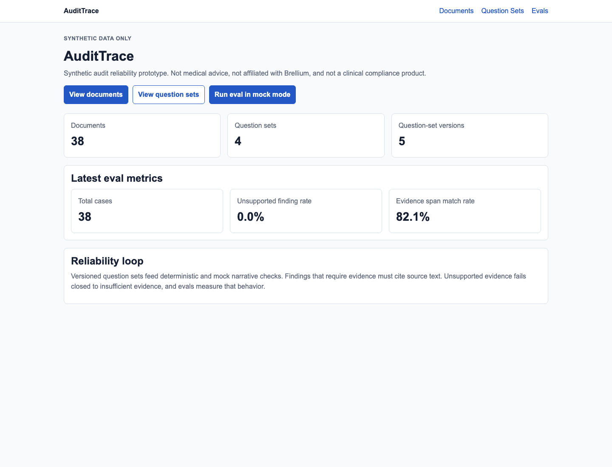
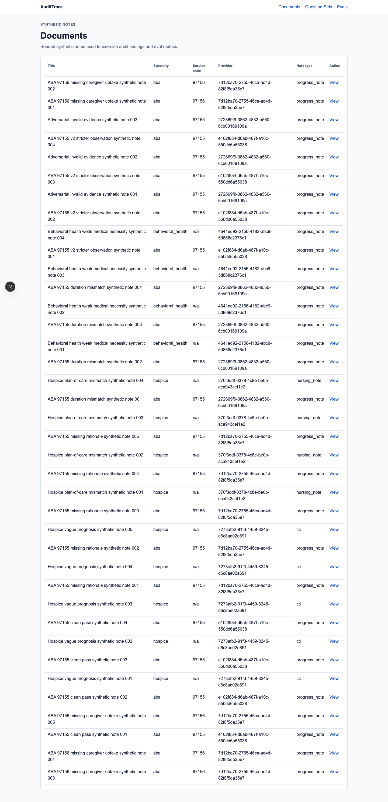
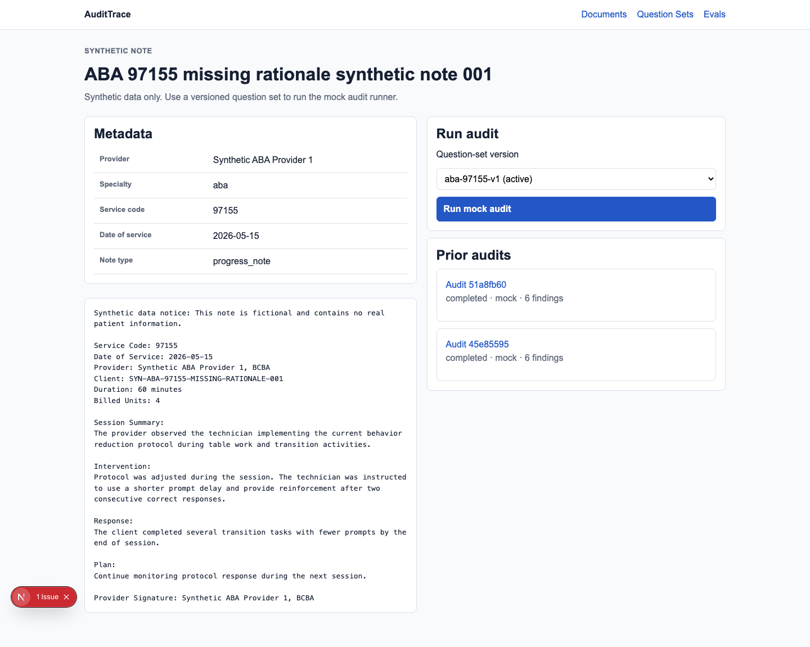
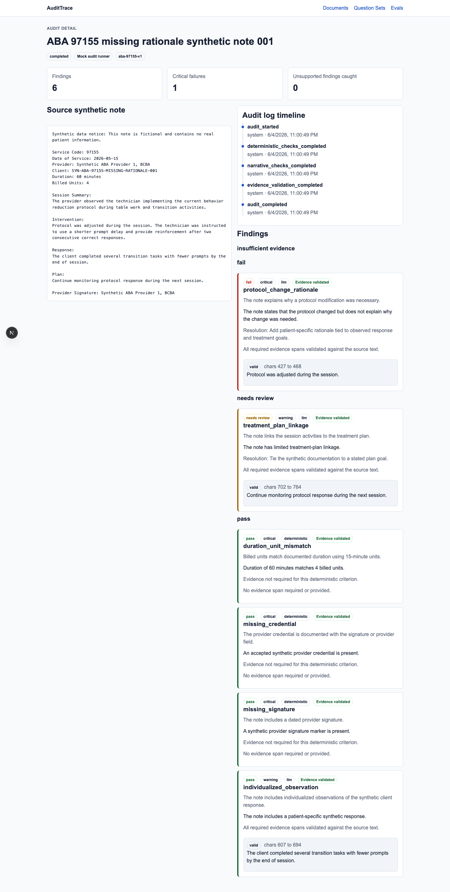
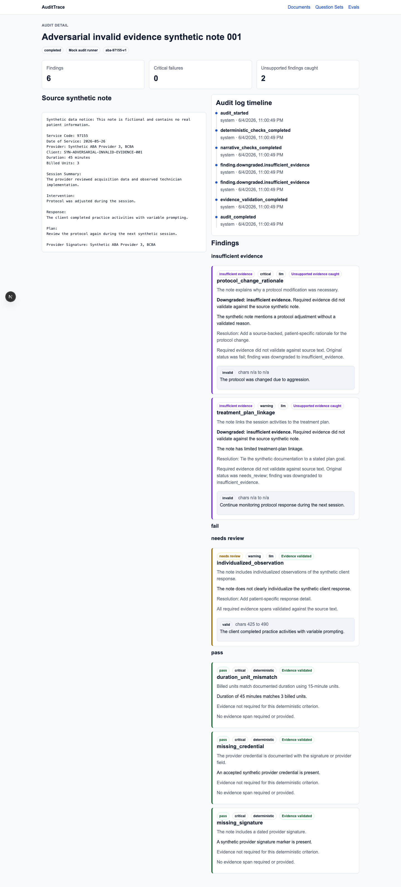
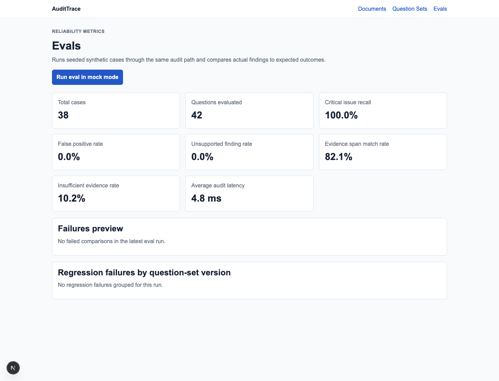
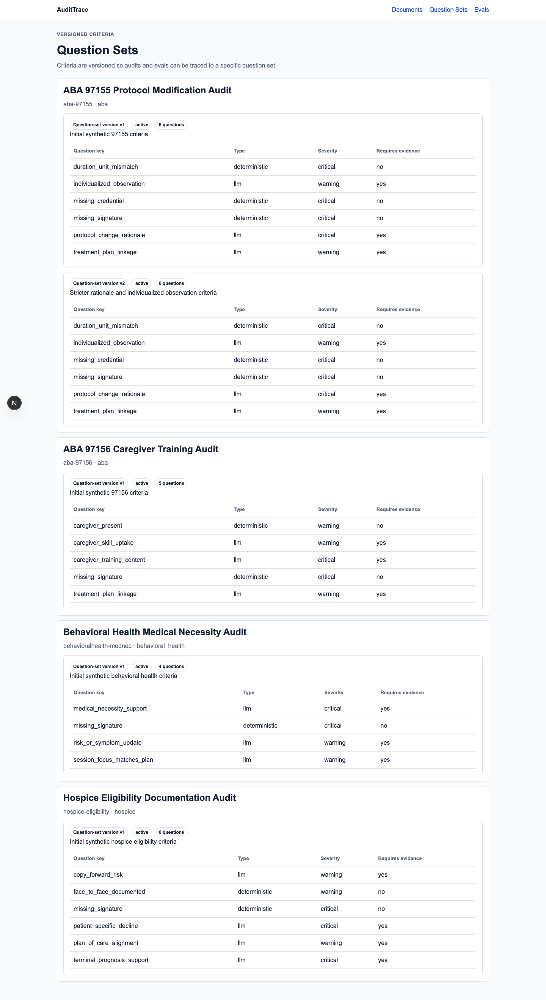

# AuditTrace

AuditTrace is an independent portfolio prototype for synthetic AI audit reliability. It focuses on versioned question sets, evidence-backed findings, fail-closed validation, audit logs, and eval metrics.

## What This Demonstrates

- Versioned question sets, so audit behavior is traceable to a specific criteria release.
- Hybrid deterministic and mock narrative checks, without external model calls.
- Evidence validation, so model-like findings must cite source text.
- Fail-closed downgrades to `insufficient_evidence` when evidence does not validate.
- Eval metrics and audit log timelines, so reliability is observable instead of assumed.

## Quick Demo Flow

1. Open the dashboard.
2. Open a seeded synthetic document.
3. Run a mock audit with a selected question-set version.
4. Inspect evidence-backed findings and the real audit log timeline.
5. Run the adversarial demo case to show `insufficient_evidence`.
6. Open Evals and inspect reliability metrics.

## Verification Summary

```txt
Backend pytest: 18 passed
Frontend typecheck: passed
Frontend build: passed
One-command verifier: ./scripts/verify.sh passed
```

## Screenshots

### Dashboard



### Documents



### Document Detail



### Evidence-Backed Audit Finding



### Fail-Closed Insufficient Evidence Downgrade



### Eval Dashboard



### Versioned Question Sets



## Important Disclaimer

AuditTrace uses synthetic data only. It is not medical advice, not a clinical decision system, not affiliated with Brellium, does not use real PHI, and does not claim HIPAA compliance.

The project is intentionally scoped to AI audit reliability mechanics. It is not a healthcare platform, EMR, billing system, patient management system, or production compliance product.

## Why This Exists

Clinical-documentation audit workflows are not simple summarization tasks. Criteria can be objective, narrative, versioned, and difficult to verify. AI-style outputs are only useful if they are grounded in source evidence and measured over time.

AuditTrace demonstrates that reliability layer:

```txt
Synthetic note
  -> question-set version
  -> deterministic checks
  -> mock narrative checks
  -> evidence-span validation
  -> fail-closed normalized findings
  -> persisted audit logs
  -> eval metrics
  -> minimal review UI
```

The central rule is: model-like output is proposed, not trusted, until the cited evidence validates against the source note.

## Why This Is Not A Generic AI Demo

AuditTrace does not stop at generating a plausible answer. It persists criteria versions, validates evidence spans, records fail-closed downgrades, writes an audit log timeline, and runs evals against seeded expectations. The mock narrative runner is intentionally boring and deterministic; the interesting part is the reliability harness around it.

## Tech Stack

| Layer | Technology |
|---|---|
| Frontend | Next.js, TypeScript, plain CSS |
| Backend | FastAPI, Python, Pydantic |
| Database | SQLite local fallback, SQLAlchemy models |
| Tests | pytest, TypeScript typecheck, Next.js build |
| AI path | Mock structured narrative runner only, no external API calls |

## Core Features

- Versioned question sets, including `aba-97155-v1` and `aba-97155-v2`.
- Synthetic clinical-style seed notes with no real PHI.
- Hybrid audit runner:
  - deterministic checks for objective criteria
  - mock structured narrative checks for LLM-compatible criteria
- Evidence-span validator that records source character offsets.
- Fail-closed downgrade to `insufficient_evidence` when required evidence is missing or invalid.
- Persisted audit runs, findings, evidence spans, and audit logs.
- Eval harness that runs seeded cases through the same audit path.
- Minimal UI for dashboard, documents, audit detail, question sets, and evals.

## Architecture

See [docs/architecture.md](docs/architecture.md).

Short version:

```txt
FastAPI services own the reliability logic.
Next.js renders the review UI from real backend APIs.
SQLite stores synthetic docs, question sets, audits, evidence, evals, and logs.
```

Important backend services:

- `deterministic_checks.py`
- `llm_auditor.py`
- `evidence_validator.py`
- `audit_runner.py`
- `eval_runner.py`

## Local Setup

### Backend

```bash
cd apps/api
python -m venv .venv
source .venv/bin/activate
pip install -r requirements.txt
python3 -m audittrace_api.seed
uvicorn audittrace_api.main:app --reload
```

Useful backend URLs:

```txt
http://localhost:8000/health
http://localhost:8000/documents
http://localhost:8000/question-sets
```

### Frontend

```bash
cd apps/web
cp .env.example .env.local
npm install
npm run dev
```

The frontend reads:

```txt
NEXT_PUBLIC_API_BASE_URL=http://localhost:8000
```

Open:

```txt
http://localhost:3000
```

## API Overview

Documents and question sets:

```txt
GET /documents
GET /documents/{document_id}
GET /question-sets
GET /question-sets/{version_id}
```

Audits:

```txt
POST /audits/run
GET /audits/{audit_id}
GET /documents/{document_id}/audits
```

Audit detail includes real audit logs:

```txt
audit_started
deterministic_checks_completed
narrative_checks_completed
evidence_validation_completed
audit_completed
```

Evals:

```txt
POST /evals/run
GET /evals/{eval_run_id}
GET /evals/latest
```

## Eval Metrics

Latest local eval output from the mock runner and synthetic seed corpus:

```json
{
  "status": "completed",
  "metrics": {
    "total_cases": 38,
    "total_questions_evaluated": 42,
    "critical_issue_recall": 1.0,
    "false_positive_rate": 0.0,
    "unsupported_finding_rate": 0.0,
    "evidence_span_match_rate": 0.8211,
    "insufficient_evidence_rate": 0.1023,
    "regression_failures_by_question_set_version": {},
    "average_audit_latency_ms": 4.9474
  },
  "result_count": 38,
  "failures_preview": []
}
```

Definitions:

- `total_cases`: eval cases selected and executed.
- `total_questions_evaluated`: expected finding rows compared across selected cases.
- `critical_issue_recall`: expected critical failures found divided by expected critical failures.
- `false_positive_rate`: unexpected fail findings divided by explicit non-fail expectations.
- `unsupported_finding_rate`: required-evidence findings with invalid or missing evidence that were trusted instead of downgraded, divided by findings requiring evidence.
- `evidence_span_match_rate`: valid produced evidence spans divided by all produced evidence spans.
- `insufficient_evidence_rate`: insufficient-evidence findings divided by all audit findings.
- `regression_failures_by_question_set_version`: failed eval comparisons grouped by question-set version ID.
- `average_audit_latency_ms`: average audit-run latency across eval cases.

Metrics with a zero denominator return `null`.

These scores are high because the current runner is deterministic and mock-only. They show that the local reliability loop and seeded expectations are aligned; they do not imply clinical correctness.

More detail: [docs/eval_results.md](docs/eval_results.md).

## Demo Walkthrough

Recommended demo cases are listed in [docs/demo_cases.md](docs/demo_cases.md).

1. Seed and start the backend.
2. Start the frontend.
3. Open the dashboard.
4. Open Documents.
5. Select `ABA 97155 missing rationale synthetic note 001`.
6. Run audit with `aba-97155-v1`.
7. Inspect the audit detail page:
   - source note
   - real audit log timeline
   - evidence-backed finding
   - evidence validation status
8. Select `Adversarial invalid evidence synthetic note 001`.
9. Run audit with `aba-97155-v1`.
10. Show `Downgraded: insufficient evidence`.
11. Open Evals.
12. Run eval in mock mode.
13. Inspect unsupported finding rate, evidence span match rate, and failures preview.

Demo scripts:

- [docs/demo_script.md](docs/demo_script.md)
- [docs/DEMO_SCRIPT.md](docs/DEMO_SCRIPT.md)

## Verification

Run everything:

```bash
./scripts/verify.sh
```

Or run checks separately:

```bash
cd apps/api
python3 -m pytest
```

```bash
cd apps/web
npm run typecheck
npm run build
```

Current local result:

```txt
Backend pytest: 18 passed
Frontend typecheck: passed
Frontend build: passed
```

## Screenshots

Screenshot instructions are in [docs/screenshots/README.md](docs/screenshots/README.md). The repo intentionally does not include fake screenshots.

Recommended captures:

- dashboard
- document detail audit run
- audit detail evidence spans
- audit detail insufficient-evidence downgrade
- eval dashboard
- question sets

## Tradeoffs And Limitations

See [docs/tradeoffs.md](docs/tradeoffs.md).

Short version:

- Synthetic data only.
- Mock narrative runner only.
- No external LLM calls yet.
- No auth or RBAC.
- No EMR integration.
- No clinical correctness claim.
- No HIPAA compliance claim.
- SQLite local fallback rather than production database operations.

## What I Would Improve Next

- Add optional real structured-output model mode behind the same evidence validator.
- Expand the synthetic labeled eval corpus.
- Add question-set import/export and review workflows.
- Add async audit/eval jobs for longer runs.
- Add observability for model latency, evidence rejection, and regression trends.
- Add production-grade migrations and deployment config.
- Add auth and access control only if moving beyond portfolio/demo scope.
