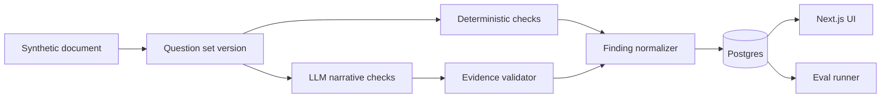

# AuditTrace

Synthetic AI chart-audit reliability system with versioned question sets, evidence-backed findings, fail-closed validation, and eval metrics.

## Why this exists

Clinical documentation audit workflows are not simple summarization problems. Criteria can be objective, subjective, versioned, and payer-specific. AI findings are only useful if they are evidence-backed, auditable, and measurable.

AuditTrace is a portfolio prototype that focuses on the reliability layer around AI audits:

```txt
synthetic note -> question-set version -> deterministic checks -> LLM checks -> evidence validation -> findings -> eval metrics
```

## What this is not

AuditTrace is not medical advice. It is not a clinical product, not a compliance-certified system, makes no HIPAA compliance claim, and is not affiliated with Brellium. It uses synthetic notes only and contains no real PHI.

## Core features

- Versioned question sets
- Hybrid deterministic + LLM audit runner
- Evidence-backed findings
- Fail-closed validation when evidence does not match source text
- Eval harness with reliability metrics
- Audit detail UI
- Eval dashboard
- Lightweight provider trend/feedback view

## Architecture



## Tech stack

| Layer | Technology |
|---|---|
| Frontend | Next.js, TypeScript, Tailwind |
| Backend | FastAPI, Python, Pydantic |
| Database | PostgreSQL / SQLite fallback |
| ORM | SQLAlchemy |
| AI | Mock model by default, optional OpenAI structured outputs |
| Tests | pytest, TypeScript typecheck |

## Demo scenarios

1. ABA 97155 note with missing protocol-change rationale.
2. ABA 97155 note that passes v1 but fails stricter v2.
3. ABA 97156 caregiver training note missing evidence of caregiver skill uptake.
4. Hospice eligibility note with vague prognosis support.
5. Adversarial case where model evidence does not exist in the source note and the finding is downgraded to `insufficient_evidence`.

## Evidence validation

Every LLM finding that requires evidence must cite direct source text. AuditTrace validates each quote against the synthetic note. If the evidence does not validate, the system downgrades the finding to `insufficient_evidence` and records an audit log.

This is the core design choice: model output is proposed, not trusted.

## Eval harness

The eval harness runs seeded synthetic cases through the same audit pipeline used by the app.

Metrics:

- Critical issue recall
- False positive rate
- Unsupported finding rate
- Evidence span match rate
- Insufficient evidence rate
- Regression failures by question-set version
- Average audit latency

Latest local result:

```txt
TODO: paste real eval output here after running.
```

## Run locally

Backend:

```bash
cd apps/api
python -m venv .venv
source .venv/bin/activate
pip install -e ".[dev]"
python -m audittrace_api.seed
uvicorn audittrace_api.main:app --reload
```

Frontend:

```bash
cd apps/web
npm install
npm run dev
```

## Verification

```bash
cd apps/api && pytest
cd apps/web && npm run typecheck && npm run build
```

## What is real

- Structured audit pipeline
- Versioned question sets
- Database-backed audit runs and findings
- Evidence validation
- Eval harness and metrics
- Synthetic note corpus
- UI for audit review and evals

## What is simplified

- Synthetic data only
- Mock model default
- Limited specialties and criteria
- No real EMR integration
- No real payer rules
- No auth/RBAC in MVP
- No HIPAA/compliance claim

## What I would improve next

- Larger clinician-reviewed synthetic eval set
- Async document processing
- Stronger retrieval for multi-document packets
- Human review workflow
- Role-scoped access controls
- Better observability and latency tracing
- Question-set import/export workflow
